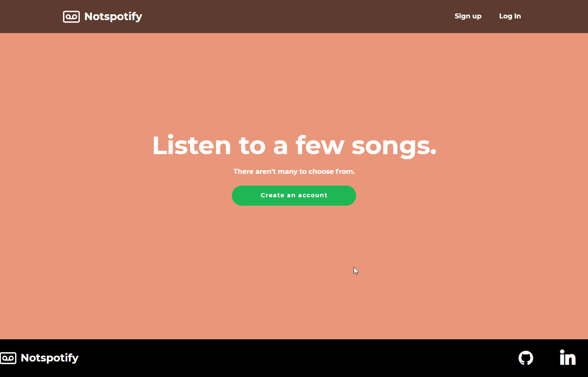
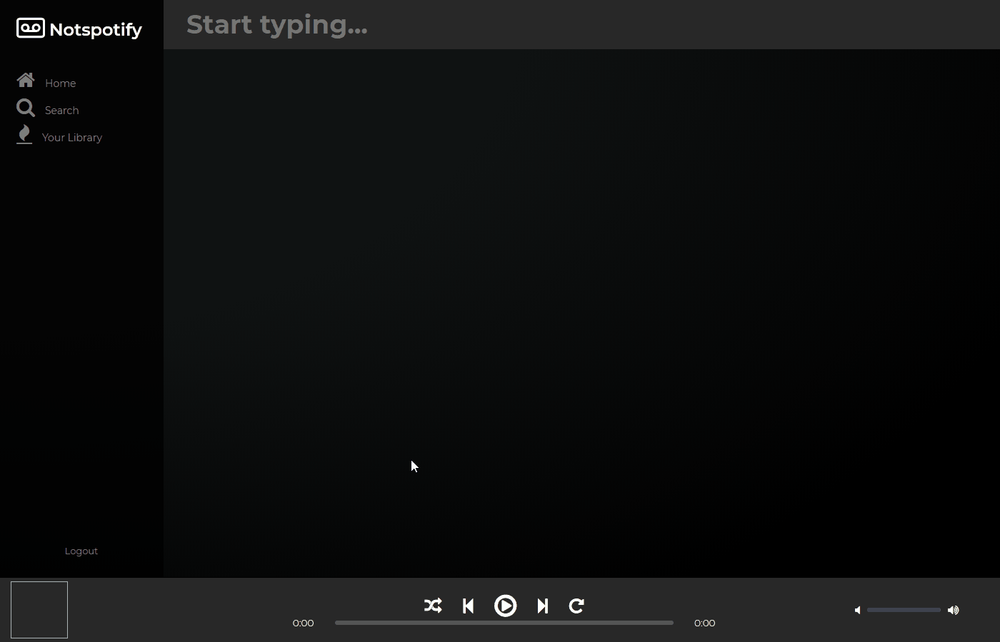

# Notspotify

[Live Demo](https://not-spotify.herokuapp.com/)

Notspotify is a single-page web application that allows users to stream my favorite songs.The design and functionality is inspired by Spotify.

## Technologies

Notspotify is built using Ruby on Rails and a PostgreSQL database to handle the backend.
AWS S3 is used to host the main media files (artist, playlist, and album art as well as song files).
React and Redux are used to manage the state of the front end alongside HTML5 and SASS for styling.
  


## Features

### Playlist Index (All playlists and followed playlists)

One of the main features of Notspotify gives the user power to create their own playlists and follow playlists they like. Coming up with a way to allow the user to see an index of all playlists on Notspotify and also allow the user to see an index that contains only the playlists they've followed was one challenge that presented itself during this project.
  
  
The code snippet below is contained in the ```PlaylistIndexContainer.js``` file which connects the playlist index to the Redux store:

```javascript
// PlaylistIndexContainer.js

const playlistSelector = (playlists, scenario, user_id, playlistFollowers) => {
  if (scenario === 'library') {
    return Object.values(playlistFollowers)
      .filter(follow => follow.userId === user_id)
      .map(follow => playlists[follow.playlistId])
  } else {
    return Object.keys(playlists).map(id => playlists[id])
  }
}

const mstp = ({entities: {playlists, playlistFollowers}, session: {id}}, ownProps) => ({
  currentUserId: id,
  playlists: playlistSelector(playlists, ownProps.match.params.main, id, playlistFollowers),
  scenario: ownProps.match.params.main
})
```

This code snippet shows the ```playlistSelector``` function as well as the ```mstp``` which is short for "map state to props".  
  
```playlistSelector``` is given an object containing all the playlists from the Redux store, a ```scenario``` which is determined to be either "home" or "library" by the URL being visited, and finally an object of playlist followers which represents a relationship table mapping all users that follow all playlists. With this information the ```playlistSelector``` function can filter out which of the playlists should be included in the return value.  
  
```mstp``` simply uses the ```playlistSelector``` function to map the appropriate playlists to the wrapped component.  
  
  ### Continuous Playback and Playbar Component
  
  Another challenging, yet essential aspect of the project was the ability for the user to browse the website while providing an uninterrupted listening experience. The code snippets below show how this issue was tackled:  
```javascript
// PlayerPage.jsx

const PlayerPage = () => {
  return (
    <div className='player-page'>
      <PlayerNavBarContainer />
      <PlayBarContainer />
      <Switch>
        <Route path='playlists/:playlistId' component={PlaylistShowContainer} />
        <Route path='/' component={PlayerDisplay} />
      </Switch>
    </div>
  )
}
```
The PlayerPage component is rendered after a user is logged-in. Here three main components are rendered, we are only concerned with the ```PlayBarContainer```, which contains the controls for music playback. By rendering the ```PlayBarContainer``` in the top-level component we can ensure that navigation through the website will not trigger it to rerender, allowing for continuous playback.

### Search



The search feature allows users to explore the content on Notspotify. The database is queried with the input from the user. The ```Search``` component sends a request to the API which will fill the Redux store with all relevent information based on the users query. The component also determines which headings to render based on the results returned with the users query. The code snippet below shows how the search componenet is implemented:
```javascript
//search.jsx
componentDidMount() {
  if (this.props.match.params.searchTerm) {
    this.performSearch(this.props.match.params.searchTerm)
  }
}

componentDidUpdate(prevProps) {

  if (this.props !== prevProps) {
    let headings = [];
    if (this.props.artists.length !== 0) {
      headings.push('ARTISTS')
    }
    if (this.props.albums.length !== 0) {
      headings.push('ALBUMS')
    }
    if (this.props.playlists.length !== 0) {
      headings.push('PLAYLISTS')
    }
    if (this.props.songs.length !== 0) {
      headings.push('SONGS')
    }
    this.setState({headings});
  }
}

handleInput() {
  return (e) => {
    this.setState({searchTerm: e.target.value})
    if (e.target.value === '') {
      this.props.history.push('/search')
    } else {
      this.props.history.push(`/search/results/${e.target.value}`)
      this.performSearch(e.target.value);
    }
  }
}

performSearch(searchTerm) {
  this.props.searchSongs(searchTerm.toLowerCase());
  this.props.searchAlbums(searchTerm.toLowerCase());
  this.props.searchArtists(searchTerm.toLowerCase());
  this.props.searchPlaylists(searchTerm.toLowerCase());
}
```
  
The following code snippet shows how items returned by the search component are handled by the ```SearchContainer``` componenet. The componenet filters items in the Redux store based on the users query:

```javascript
//SearchContainer.js
const entitySelector = (entity, object, query) => {
  let map = {
    song: 'title',
    album: 'title',
    artist: 'name',
    playlist: 'title'
  }
  let column = map[entity];

  return Object.values(object)
    .filter(object => object[column].toLowerCase().includes(query))
}

const mstp = (state, {match: {params: {searchTerm}}}) => {

  if (searchTerm) {
    return {
      songs: entitySelector('song', state.entities.songs, searchTerm.toLowerCase()),
      albums: entitySelector('album', state.entities.albums, searchTerm.toLowerCase()),
      artists: entitySelector('artist', state.entities.artists, searchTerm.toLowerCase()),
      playlists: entitySelector('playlist', state.entities.playlists, searchTerm.toLowerCase())
    }
  } else {
    return {
      songs: [],
      albums: [],
      artists: [],
      playlists: []
    }
  }
}
```


## MVPs

1. Hosting on Heroku
2. New account creation, login, and guest/demo login

   * Users can sign up, sign in, log out
   * Users can use a demo login to try the site
   * Users can't use certain features without logging in (stream music, view available songs)
3. Playlist CRUD

   * Logged in users can create playlists
   * Users can view a list playlists
   * Logged in users can edit their existing playlists
   * Logged in users can delete their playlists
4. Search

   * Logged in users can search for available content
   * Search results return all relevant content
5. Continuous play while navigating site

   * Users can stream music while navigating through the site
   * Song playback is uninterrupted while user is navigating
6. Following playlists/artists/albums/songs

   * Users can follow other's playlists and artists/songs/albums
7. Production README
